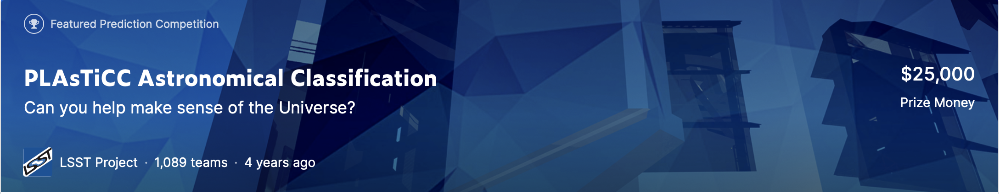

# Kaggle PLAsTiCC Astronomical Classification

[Kaggle page](https://www.kaggle.com/c/PLAsTiCC-2018)

The Photometric LSST Astronomical Time-Series Classification Challenge (PLAsTiCC) asked Kagglers to help prepare to classify the data from this new survey. Competitors classified astronomical sources that vary with time into different classes, scaling from a small training set to a very large test set of the type the LSST will discover.

The solution includes a combination of LightGBM and FNN models and provides a score on the Private Leaderboard - 0.98465. The features for the models are some statistics calculated for the light-curve data. The statistic calculation was based on [tsfresh](https://tsfresh.readthedocs.io/en/latest/) and speeded up with [numba](https://numba.pydata.org).
